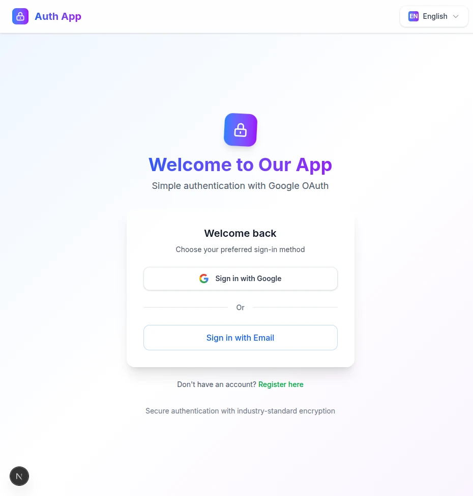
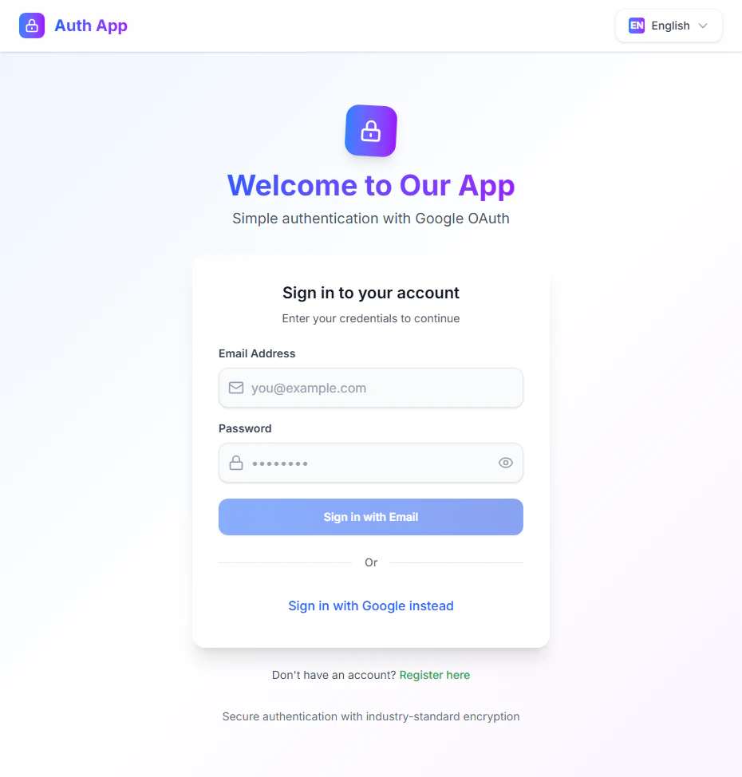
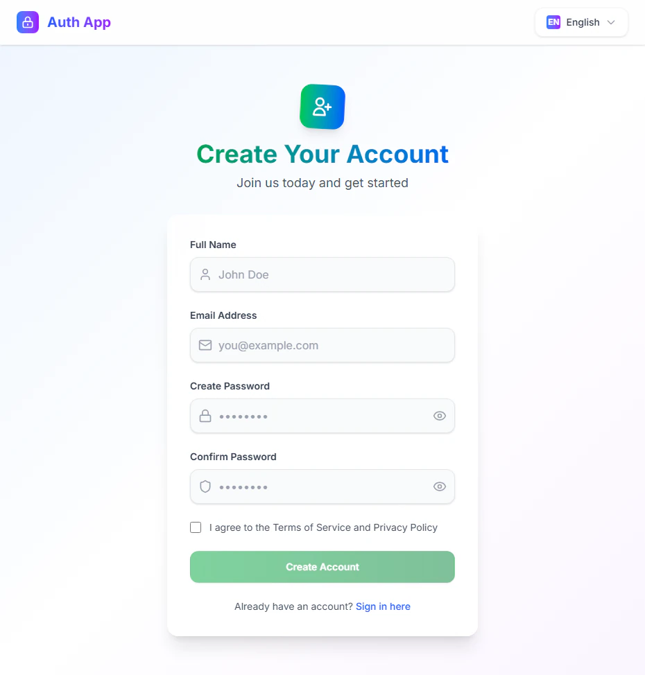
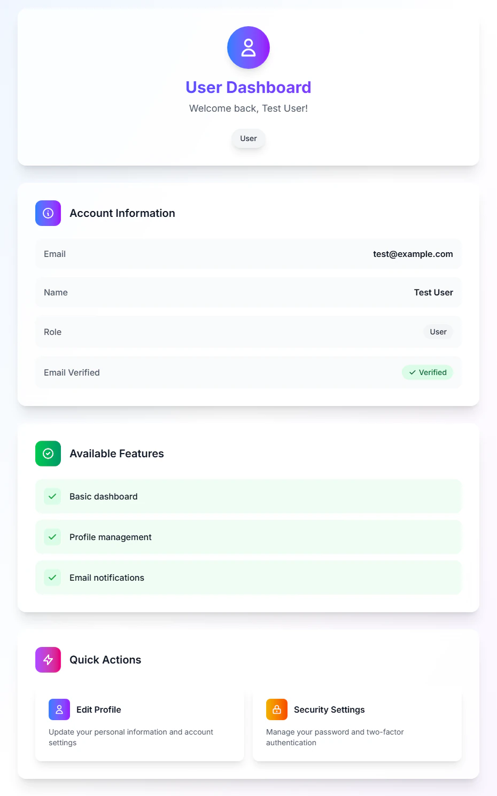
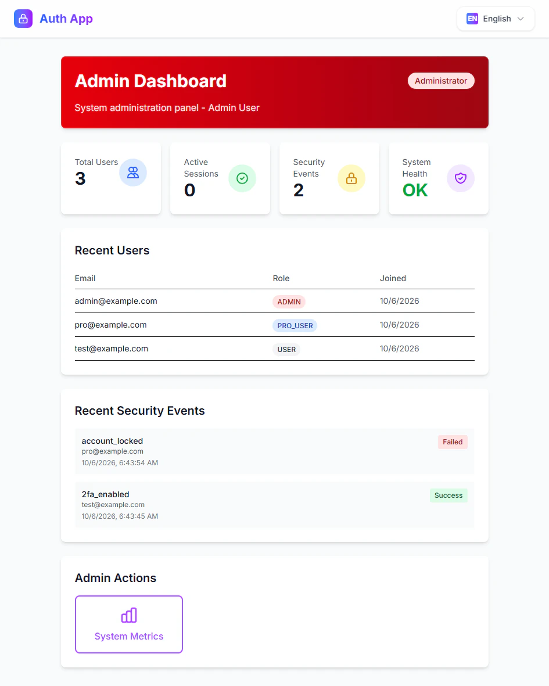
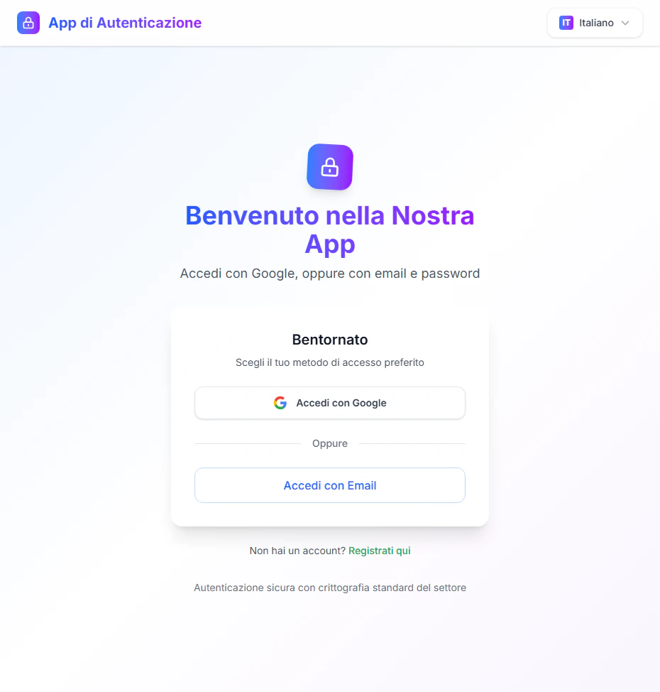
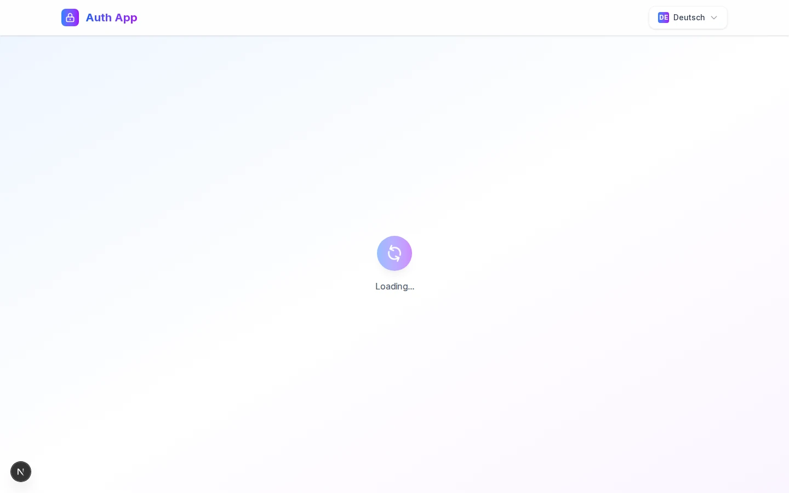

# Next.js Auth Starter

A self-hostable authentication starter for **Next.js 15** with credentials +
Google login, **enforced TOTP two-factor auth**, role-based access control and
five-locale internationalization — wired to PostgreSQL through Prisma and
covered by unit, integration and end-to-end tests.



## Features

- **Authentication (Auth.js v5 / NextAuth beta)**
  - Email + password (bcrypt cost 12) and optional Google OAuth
  - **Two-factor authentication that is actually enforced**: once a user
    enables TOTP, password-only logins are rejected server-side in
    `authorize()`; single-use backup codes included
  - Two-stage login form (password → authenticator code)
  - Email verification and password reset flows (Resend; simulated in dev)
  - Account linking (Google ↔ credentials) with confirmation tokens
- **Authorization**
  - Roles `USER` / `PRO_USER` / `ADMIN` as a Prisma enum, carried in the JWT
  - `withRole()` guards for APIs, `role-guard` for UI, protected route groups
    in the middleware, role-specific dashboards
- **Security hardening**
  - Account lockout and per-flow rate limiting (login, 2FA, verification…)
  - 2FA secrets & backup codes encrypted at rest (`ENCRYPTION_KEY`)
  - CSP + security headers set centrally in `next.config.ts`
  - Environment validated at boot — the server refuses to start misconfigured
  - Security-event audit trail in the database
  - Honest limitations documented in [SECURITY.md](SECURITY.md)
- **Internationalization** — next-intl with `en`, `es`, `fr`, `it`, `de`;
  key parity across locales is enforced by a validator in the pre-commit hook
- **Testing** — 292 Jest unit/integration tests and 77 Playwright E2E tests,
  including a real TOTP login exercised in the browser (codes generated with
  `otplib`, nothing mocked at the boundary)

## Stack

| Layer      | Choice                              |
| ---------- | ----------------------------------- |
| Framework  | Next.js 15.5 (App Router), React 19 |
| Auth       | Auth.js v5 (`next-auth@5.0.0-beta`) |
| Database   | PostgreSQL 16, Prisma 6             |
| Validation | Zod 4                               |
| Styling    | Tailwind CSS 4                      |
| i18n       | next-intl 4                         |
| Tests      | Jest 30, Playwright 1.55            |
| Language   | TypeScript 5.9 (strict)             |

## Quick start

Prerequisites: **Node ≥ 20**, **pnpm**, **Docker** (for PostgreSQL).

```bash
git clone <this-repo> && cd nextjs-auth-app
pnpm install

# 1. Environment
cp .env.example .env
#    then edit .env and set real values for:
#    AUTH_SECRET / NEXTAUTH_SECRET  →  openssl rand -base64 32
#    ENCRYPTION_KEY                 →  openssl rand -hex 32

# 2. Database (two dockerized instances: dev :5432, test :5433)
pnpm docker:up
pnpm db:setup        # prisma generate + push schema
pnpm db:seed         # demo users

# 3. Run
pnpm dev             # http://localhost:3000
```

Sign in with a seeded demo user:

| Role     | Email               | Password    |
| -------- | ------------------- | ----------- |
| USER     | `test@example.com`  | `Test123!`  |
| PRO_USER | `pro@example.com`   | `Pro123!`   |
| ADMIN    | `admin@example.com` | `Admin123!` |

To try 2FA end-to-end: sign in → **Account → Enable 2FA** → scan the QR code
with any authenticator app → sign out → sign in again. The password alone will
no longer be accepted.

Ports 5432/5433 busy, or `P1001` from Prisma? See
[docs/setup/DATABASE_SETUP_GUIDE.md](docs/setup/DATABASE_SETUP_GUIDE.md).
Google sign-in is optional — set it up with
[docs/setup/google-oauth-setup.md](docs/setup/google-oauth-setup.md).

## Screenshots

|                                                         |                                                           |
| ------------------------------------------------------- | --------------------------------------------------------- |
|                 |            |
|  |  |
|         |            |

## Environment variables

Everything lives in [`.env.example`](.env.example) with one comment per
variable. Summary:

| Variable                                                            | Required                | Purpose                                |
| ------------------------------------------------------------------- | ----------------------- | -------------------------------------- |
| `DATABASE_URL`                                                      | always                  | PostgreSQL connection string           |
| `AUTH_SECRET` / `NEXTAUTH_SECRET`                                   | production (≥ 32 chars) | session/JWT signing                    |
| `NEXTAUTH_URL`                                                      | production (https)      | canonical origin                       |
| `ENCRYPTION_KEY`                                                    | production (64 hex)     | AES key for 2FA secrets & backup codes |
| `GOOGLE_CLIENT_ID` / `_SECRET`                                      | optional (both or none) | Google OAuth                           |
| `RESEND_API_KEY`, `EMAIL_FROM`                                      | optional                | real e-mail sending (dev simulates)    |
| `AUTH_RATE_LIMIT`, `MAX_LOGIN_ATTEMPTS`, `ACCOUNT_LOCKOUT_DURATION` | optional                | security tuning                        |

Configuration is validated at boot by `src/lib/env.ts`; invalid production
config stops the server with a list of offending variable **names** (never
values).

## Project structure

```
src/
├── app/
│   ├── [locale]/          # pages (home, register, account, dashboards, admin)
│   └── api/               # NextAuth, account info, admin metrics, health
├── components/            # auth forms, account management, RBAC guards, UI kit
├── lib/
│   ├── actions/           # server actions (Zod-validated, auth()-derived identity)
│   ├── auth/, auth-config # NextAuth config, RBAC helpers
│   ├── repositories/      # data access behind interfaces
│   ├── commands/, events/ # write operations + domain events (audit trail)
│   ├── errors/, validation# typed errors, shared Zod schemas
│   └── security, rate-limit, env, two-factor, …
├── middleware.ts          # locale routing + protected route groups
├── i18n.ts + messages/    # next-intl, 5 locales
prisma/                    # schema + demo seed
e2e/                       # Playwright suite (page-object model)
```

More detail in [docs/ARCHITECTURE.md](docs/ARCHITECTURE.md).

## Testing

```bash
pnpm test        # Jest — 292 tests (unit + integration)
pnpm test:e2e    # Playwright — 77 E2E tests (needs the docker test DB)
pnpm check       # eslint + tsc --noEmit
```

The E2E suite seeds its own fixtures (including an encrypted 2FA secret) and
generates real TOTP codes in the tests. Details, caveats and troubleshooting:
[docs/TESTING.md](docs/TESTING.md).

## Deployment

`pnpm build && pnpm start` on anything that runs Node 20+ with a PostgreSQL
nearby. Read [docs/DEPLOYMENT.md](docs/DEPLOYMENT.md) and — before going
live — the **Production Hardening Checklist** in [SECURITY.md](SECURITY.md).

## Known limitations

Deliberate trade-offs, documented rather than hidden (full list in
[SECURITY.md](SECURITY.md)):

- Rate limiting is **in-memory** (per process) — use a shared store when
  scaling horizontally.
- 2FA secret encryption uses CryptoJS AES with a passphrase-derived key;
  a KMS-managed AES-256-GCM setup is the recommended production upgrade.
- CSP ships with `script-src 'unsafe-inline'` (a static header on prerendered
  pages cannot carry per-request nonces) — the structural directives still
  hold.
- `next-auth` v5 is a **beta**; pin the exact version when you fork.
- No migration files — the starter uses `prisma db push`; baseline your own
  migrations for production.

## Contributing & security

Contributions welcome — see [CONTRIBUTING.md](CONTRIBUTING.md).
Security reports: **privately**, per [SECURITY.md](SECURITY.md).

## License

[MIT](LICENSE)
