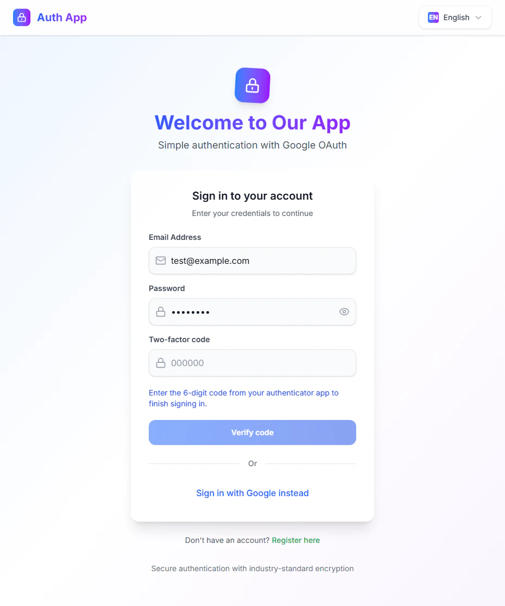
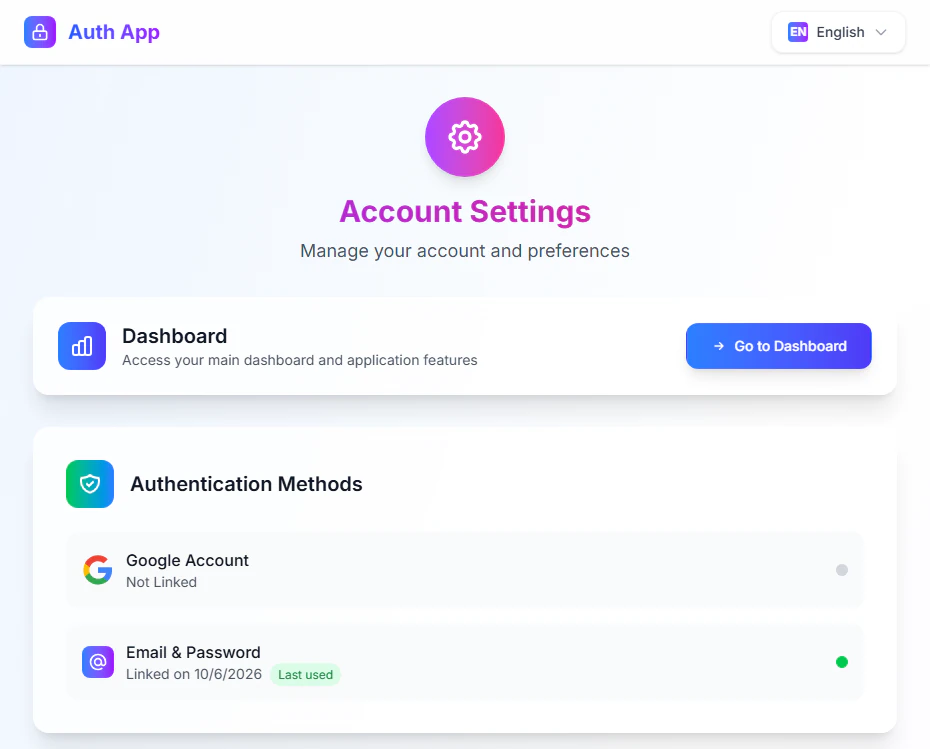
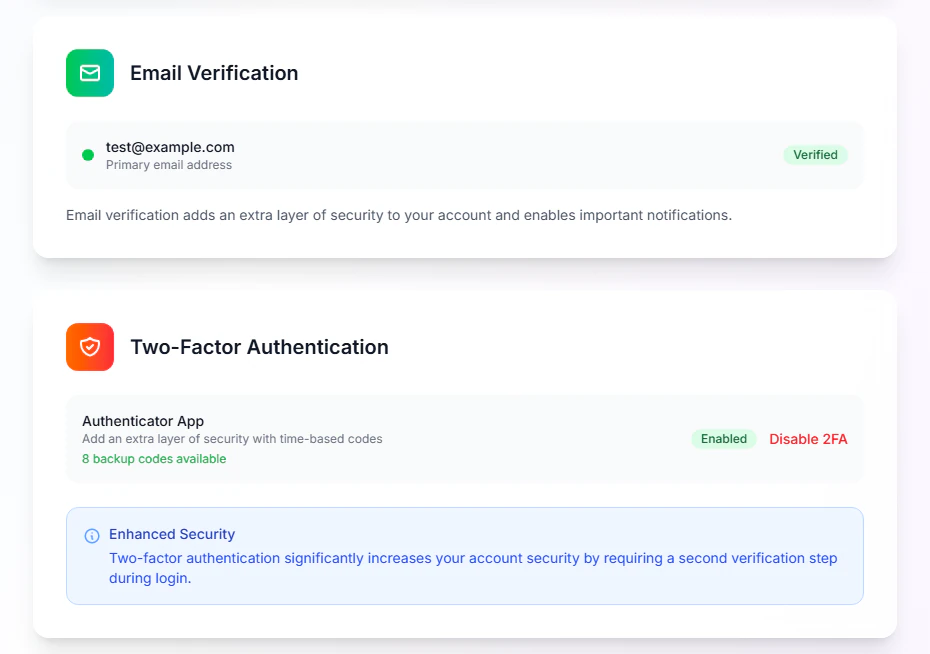

# Next.js Auth Starter

[](https://github.com/Gurgant/nextjs-auth-app/actions/workflows/ci.yml)

A self-hostable authentication starter for **Next.js 15**: e-mail + password
sign-in with **TOTP two-factor authentication enforced on the server**,
optional Google sign-in, role-based access control and five locales, on
PostgreSQL through Prisma.

Both test suites run in CI, Playwright with retries off. The 2FA
enforcement, the Google link gate and the return-address rule were each
changed on purpose, and each change made tests fail.
[SECURITY.md](SECURITY.md) names the test or the measurement behind a
protection, and says where a statement was read in a library's source and
not measured.

[Quick start](#quick-start) · [Screenshots](#screenshots) ·
[Scope and limits](#scope-and-limits) ·
[Security](SECURITY.md#what-the-application-protects) ·
[Architecture](docs/ARCHITECTURE.md) · [Testing](docs/TESTING.md) ·
[Deployment](docs/DEPLOYMENT.md) · [Changelog](CHANGELOG.md)

## What it does

- **E-mail + password sign-in** (Auth.js v5 / `next-auth` beta; bcrypt),
  throttled per e-mail and per IP, with a temporary **account lockout** in
  the database after repeated failed sign-ins.
- **TOTP two-factor authentication enforced in `authorize()`**: once a user
  enables it, a password-only sign-in is refused on the server. A backup
  code can take the place of the authenticator code, once. Secrets and
  backup codes are encrypted at rest.
- **Optional Google sign-in.** A Google account is linked to an existing
  user only after the server has checked that user's password, and none of
  Google's tokens are stored. A password can be added to a Google account.
  Without `GOOGLE_CLIENT_ID` / `GOOGLE_CLIENT_SECRET` the button is not
  shown.
- **Sessions that end on the server**: signing out ends that session,
  changing the password ends every session of the user, deleting the account
  ends its sessions in every browser.
- **A return address checked on the server**: after a sign-in, after linking
  Google or after a sign-out the browser is sent to the requested address
  only if it is on the application's own origin, otherwise to the base URL
  (the open-redirect case). For the return from Google this was read in
  Auth.js's source, not measured.
- **Roles** `USER` / `PRO_USER` / `ADMIN`, re-read from the database at every
  session check. Protected pages check the session and role on the server
  and redirect; `withRole()` guards the role-restricted API route.
- **E-mail verification** through Resend (simulated while no API key is set)
  and **security events** in the database, among them 2FA changes, links and
  refused links, and lockouts.
- **Configuration validated when the server initialises** (under
  `next start`, on the first request): with missing or malformed settings,
  or published example secrets in production, the app is not served. CSP and
  security headers are set centrally in `next.config.ts`.
- **Five locales** — next-intl with `en`, `es`, `fr`, `it`, `de`, for
  sign-in, registration, the account page and what the server actions
  answer. The parts that are English only are under
  [Scope and limits](#scope-and-limits).
- **An account page and an admin page that read the database**: sign-in
  methods with a "Last used" badge and 2FA status; user counts, recent users
  and security events. Two tiles of the admin page are placeholders (see
  [Scope and limits](#scope-and-limits)).

What each protection does and where it stops, with the test or the
measurement behind it where there is one: [SECURITY.md](SECURITY.md).

## How it is checked

- **Testing** — 2102 Jest tests (unit + real-PostgreSQL integration) and 122
  Playwright E2E tests, including a real TOTP sign-in with codes generated by
  `otplib`; both suites run in CI on every push to `main` and every pull
  request, the E2E suite with Playwright retries off.
- **What the tests measure** — the integration file runs registration, the
  lockout, the session check and the Google link gate on real PostgreSQL;
  the E2E suite drives Chromium through sign-in, 2FA, registration, access
  by role, the five locales and the ways a session ends.
- **Mutation checks** — the 2FA enforcement, the Google link gate and the
  return-address rule were each changed on purpose, one change at a time,
  and every change made tests fail. The changes, and for the link gate and
  the return address the number of tests each one failed, are in
  [docs/TESTING.md](docs/TESTING.md).
- **No second attempts** — a test that fails once fails the job: the helpers
  retry no request, and Playwright retries are off.
- **CI** ([`.github/workflows/ci.yml`](.github/workflows/ci.yml)) — two jobs
  on Node 22: `checks` (typecheck, lint, the translation validator, Jest,
  build, client-bundle guard) and `e2e` (the Playwright suite against
  `next dev` and a PostgreSQL service container).
- **Guards that read the sources** — `pnpm test:unit` fails on a module that
  nothing imports, on an exported name that is mentioned nowhere but in its
  definition, on a link written as a literal that no page or route handler
  serves and on a message key that no application file reads (each guard
  lists in its file what it cannot see), on a translation whose arguments
  or tags are not those of the English text or that the installed next-intl
  cannot format, on a text with one of the wordings that the editors of the
  five languages removed (a list of narrow searches, not a proof-reader:
  [CONTRIBUTING.md](CONTRIBUTING.md#conventions-of-each-language)), and
  when the installed Auth.js is not the one whose source the security
  statements were read in. CI fails if known server-only code shows up in
  the browser bundles.
- **Documents** — [SECURITY.md](SECURITY.md) and `docs/` state what was
  measured or what the code does, and say so where a statement was read in a
  library's source and not measured; this README is their summary.
- **Releases** — each release has its section in
  [CHANGELOG.md](CHANGELOG.md), from v2.1.0 on with what to do when upgrading
  from the release before.

## Screenshots

<table>
  <tr>
    <td width="50%" valign="top"><br><sub>Sign-in form</sub></td>
    <td width="50%" valign="top"><br><sub>With 2FA enabled, the password is followed by the code</sub></td>
  </tr>
  <tr>
    <td width="50%" valign="top"><br><sub>Account page: sign-in methods, with the one used last</sub></td>
    <td width="50%" valign="top"><br><sub>Account page: e-mail verification and 2FA status</sub></td>
  </tr>
  <tr>
    <td width="50%" valign="top"><br><sub>Registration</sub></td>
    <td width="50%" valign="top"><br><sub>Home page in Italian, one of the five locales</sub></td>
  </tr>
  <tr>
    <td width="50%" valign="top"><br><sub>Admin page</sub></td>
    <td width="50%" valign="top"><br><sub>User dashboard</sub></td>
  </tr>
</table>

Taken on 2026-10-06 (the Italian home page, the 2FA step and the 2FA
status of the account page again on 2026-10-07, after their texts changed)
from a local `next dev`, with the three demo users of
`pnpm db:seed` and with Google sign-in configured: without Google the home
page shows the e-mail form directly, and the line under its title reads
"Sign in with e-mail and password". The two account pictures are parts of
their page. On the admin page "Active Sessions" is
always 0 and "System Health" is static (see
[Scope and limits](#scope-and-limits)); its two security events were written
by the application during the capture, when one demo user enabled 2FA and
five wrong passwords locked another.

## Quick start

Prerequisites: **Node ≥ 20**, **pnpm**, **Docker** (for PostgreSQL).

```bash
git clone https://github.com/Gurgant/nextjs-auth-app.git && cd nextjs-auth-app
pnpm install

# 1. Environment
cp .env.example .env
#    The copied values work for local development. For anything real, set:
#    AUTH_SECRET / NEXTAUTH_SECRET  →  openssl rand -base64 32
#    ENCRYPTION_KEY                 →  openssl rand -hex 32
#    (in production the example values are rejected)

# 2. Database (two dockerized instances: dev :5432, test :5433)
pnpm docker:up
pnpm db:setup        # prisma generate + push schema
pnpm db:seed         # demo users

# 3. Run
pnpm dev             # http://localhost:3000
```

Sign in with a seeded demo user:

| Role     | Email               | Password    |
| -------- | ------------------- | ----------- |
| USER     | `test@example.com`  | `Test123!`  |
| PRO_USER | `pro@example.com`   | `Pro123!`   |
| ADMIN    | `admin@example.com` | `Admin123!` |

To try 2FA end-to-end: sign in → **Account → Enable 2FA → Start Setup** →
scan the QR code with an authenticator app → enter the current 6-digit code →
**Verify & Enable** → **Download Backup Codes** → **Complete Setup** → sign
out → sign in again. The password alone is no longer accepted.

Ports 5432/5433 busy, or `P1001` from Prisma? See
[docs/setup/DATABASE_SETUP_GUIDE.md](docs/setup/DATABASE_SETUP_GUIDE.md).
Google sign-in is optional — set it up with
[docs/setup/google-oauth-setup.md](docs/setup/google-oauth-setup.md).

## Stack

| Layer      | Choice                                         |
| ---------- | ---------------------------------------------- |
| Framework  | Next.js 15.5 (App Router), React 19            |
| Auth       | Auth.js v5 (`next-auth@5.0.0-beta.32`)         |
| Database   | PostgreSQL 16, Prisma 6                        |
| Validation | Zod 4                                          |
| Styling    | Tailwind CSS 4                                 |
| i18n       | next-intl 4                                    |
| Tests      | Jest 30, Playwright 1.55                       |
| Language   | TypeScript 5.9 (strict; ESLint fails on `any`) |

## Project structure

```text
src/
├── app/
│   ├── [locale]/          # pages: home, sign-in, register, account, dashboards, admin,
│   │                      # auth error, e-mail verification, terms and privacy
│   │                      # (two placeholder pages)
│   └── api/               # Auth.js, link/unlink Google, account info,
│                          # admin metrics, health
├── components/            # auth forms, account management, layouts, UI kit,
│                          # the body of the two placeholder pages
├── hooks/                 # client hooks (account data, Google availability)
├── lib/
│   ├── actions/           # server actions (account actions take identity from auth();
│   │                      #  the public send-verification-e-mail action uses the given address)
│   ├── auth/              # role helpers (roles.ts), API route guard (rbac.ts), lockout policy,
│   │                      #  session check (session-revocation.ts), Google e-mail verification,
│   │                      #  link gate for Google accounts (link-gate.ts, link-grant.ts)
│   ├── auth-config.ts     # Auth.js configuration, credentials authorize()
│   ├── auth.ts            # auth(), handlers; passes Auth.js the session check (jwt.decode)
│   ├── repositories/      # user repository (credentials check, lockout)
│   ├── commands/, events/ # write operations + in-memory domain events
│   └── security, rate-limit, env, env-rules, two-factor, email, …
├── middleware.ts          # locale routing (next-intl); pages enforce auth themselves
└── i18n.ts                # next-intl request config
messages/                  # en, es, fr, it, de
prisma/                    # schema + demo seed
e2e/                       # Playwright specs + small strict helper modules
```

More detail in [docs/ARCHITECTURE.md](docs/ARCHITECTURE.md).

## Running the tests and checks

```bash
pnpm db:push:test                       # once: schema on the test DB (:5433)
pnpm test                               # Jest — 2102 tests (the integration file uses the test DB)
pnpm test:unit                          # Jest without any database — 2049 tests
pnpm exec playwright install chromium   # once
pnpm test:e2e                           # Playwright — 122 tests against the test DB
pnpm check                              # eslint + tsc --noEmit
pnpm validate-translations              # key parity of the five message files
pnpm format:check                       # Prettier; the pre-commit hook runs these last three
```

The E2E run starts its own dev server on the test database (or on the
`DATABASE_URL` you pass in the shell), stops if something already listens on
`:3000` (stop the `pnpm dev` from the Quick Start first), and refuses to reset
the database your `.env` points at (same host, port and database name). It seeds
its own users (including one with an encrypted 2FA secret), generates real
TOTP codes, and works with or without Google configured. Details, coverage
and caveats: [docs/TESTING.md](docs/TESTING.md).

## Environment variables

The main variables live in [`.env.example`](.env.example) with a comment
each. Summary:

| Variable                          | Required                        | Purpose                                                                                                      |
| --------------------------------- | ------------------------------- | ------------------------------------------------------------------------------------------------------------ |
| `DATABASE_URL`                    | always                          | PostgreSQL connection string                                                                                 |
| `ENCRYPTION_KEY`                  | always (64 hex chars)           | passphrase for encrypting 2FA secrets and backup codes                                                       |
| `AUTH_SECRET` / `NEXTAUTH_SECRET` | always (≥ 32 chars)             | key material for the encrypted session token                                                                 |
| `NEXTAUTH_URL`                    | recommended (https in prod)     | canonical origin; e-mail links use it (else localhost)                                                       |
| `GOOGLE_CLIENT_ID` / `_SECRET`    | optional (both or none)         | Google sign-in                                                                                               |
| `RESEND_API_KEY`, `EMAIL_FROM`    | optional                        | real e-mail delivery; while the key is unset it's simulated                                                  |
| `AUTH_RATE_LIMIT`                 | optional (default 10)           | failed sign-ins per minute, per e-mail and per IP                                                            |
| `MAX_LOGIN_ATTEMPTS`              | optional (default 5)            | consecutive failures before a temporary lock                                                                 |
| `ACCOUNT_LOCKOUT_DURATION`        | optional (default 15, minutes)  | lock duration                                                                                                |
| `SESSION_MAX_AGE`                 | optional (default 604800, secs) | session idle timeout (300 – 2 592 000)                                                                       |
| `BCRYPT_ROUNDS`                   | optional (4–15, default 12)     | hashing cost: registration, password change / add; not checked at start-up (out-of-range values are ignored) |

Configuration is validated when the server initialises (`src/lib/env.ts`;
under `next start`, on the first request): with an invalid configuration the
process keeps running but serves nothing — every request fails and the log
lists the offending variable **names** (never values).

## Deployment

`pnpm install && pnpm prisma:generate && pnpm build && pnpm start` on
anything that runs Node 20+ with PostgreSQL reachable. For a new database,
apply the schema first (`pnpm prisma:push` with the production
`DATABASE_URL`, or your own migrations). The Prisma client is generated into
`src/generated/`, which is not committed. Hosting, environment and upgrades:
[docs/DEPLOYMENT.md](docs/DEPLOYMENT.md).

A database that an earlier version has used is upgraded in the order that
[docs/DEPLOYMENT.md](docs/DEPLOYMENT.md) gives for that version. From 2.4.0
to 2.5.0, pushing the schema and starting the new code in either order
leaves a time in which nobody can sign in, and once the database has a user
the push would drop data: it stops unless it is given `--accept-data-loss`,
or, in a terminal, asks first. The document gives two measured ways through
it. From 2.5.0 to 2.5.1 the schema does not change; one optional SQL
statement clears the Google tokens that earlier versions stored.

Before going live, work through the **Production Hardening Checklist** in
[SECURITY.md](SECURITY.md#production-hardening-checklist).

## Scope and limits

A starter kit to read, fork and adapt, built July–August 2025 as a study
project and reworked in 2026. One person maintains it on a best-effort
basis.

- **Demo content**: the "Available Features" list of the user dashboard is a
  fixed list per role; the PRO dashboard shows sample figures, a static
  feature list and buttons that do nothing; on the admin page
  "System Health: OK" is static and "Active Sessions" is always 0.
- **Placeholder pages**: `/{locale}/terms` and `/{locale}/privacy`, linked
  from the registration form, hold placeholder text and say so: replace both.
- **Not implemented**: password reset; new backup codes for an account that
  keeps 2FA enabled (the eight codes are made when 2FA is enabled).
- **English only**: the dashboards and the admin page; the security-alert
  e-mail, which is sent when 2FA is enabled or disabled and is English under
  every locale; also single texts elsewhere, among them what a screen reader
  is told about the language selector and the show-password button, and the
  JSON errors of `/api/admin/metrics`.
- **Before a deployment**, read
  [SECURITY.md](SECURITY.md#known-limitations). Among the limits:
  - Google sign-in is not asked for a TOTP code, and disabling 2FA needs
    only a session.
  - Anyone who knows an e-mail address can keep that account's password
    sign-in locked.
  - Rate limits live in the memory of one process, and the IP key comes from
    headers the client controls unless a proxy overwrites `X-Forwarded-For`.
  - E-mail is simulated, in production too, while `RESEND_API_KEY` is unset.
  - There is no list of a user's sessions.

## Contributing & security

Contributions are welcome — see [CONTRIBUTING.md](CONTRIBUTING.md).
Report vulnerabilities **privately**, as described in [SECURITY.md](SECURITY.md).

## License

[MIT](LICENSE)
