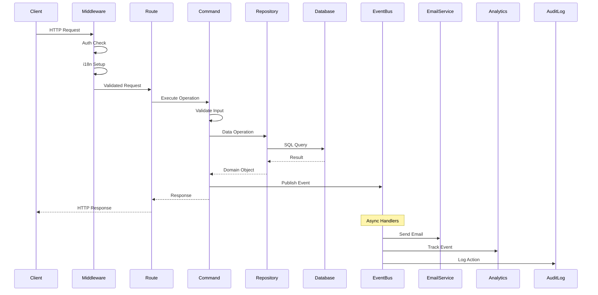
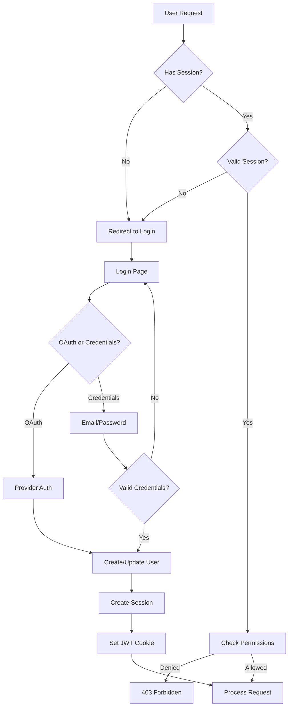
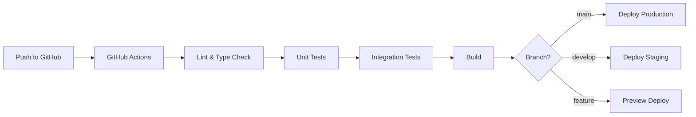

# 🏛️ Reference Architecture Documentation

## 📐 System Architecture Overview

```
┌────────────────────────────────────────────────────────────────────┐
│                         CLIENT LAYER                                │
│  ┌──────────────┐  ┌──────────────┐  ┌──────────────┐             │
│  │   Browser    │  │  Mobile App  │  │   API Client │             │
│  └──────────────┘  └──────────────┘  └──────────────┘             │
└────────────────────────────────────────────────────────────────────┘
                                │
                                ▼
┌────────────────────────────────────────────────────────────────────┐
│                      PRESENTATION LAYER                             │
│  ┌──────────────────────────────────────────────────────────┐     │
│  │               Next.js 15 App Router                       │     │
│  ├──────────────────────────────────────────────────────────┤     │
│  │  • Server Components  • Client Components  • API Routes  │     │
│  │  • Middleware         • Static Generation  • Streaming   │     │
│  └──────────────────────────────────────────────────────────┘     │
└────────────────────────────────────────────────────────────────────┘
                                │
                                ▼
┌────────────────────────────────────────────────────────────────────┐
│                       MIDDLEWARE LAYER                              │
│  ┌────────────┐  ┌────────────┐  ┌────────────┐  ┌────────────┐ │
│  │    Auth    │  │    i18n    │  │Rate Limit  │  │   CORS     │ │
│  │  NextAuth  │  │ next-intl  │  │  LRU Cache │  │  Headers   │ │
│  └────────────┘  └────────────┘  └────────────┘  └────────────┘ │
└────────────────────────────────────────────────────────────────────┘
                                │
                                ▼
┌────────────────────────────────────────────────────────────────────┐
│                    APPLICATION LAYER                                │
│  ┌──────────────────────────────────────────────────────────┐     │
│  │                    Business Logic                         │     │
│  ├────────────────┬───────────────┬────────────────────────┤     │
│  │    Commands    │    Events     │      Services          │     │
│  │  • Register    │  • UserLogin  │  • EmailService        │     │
│  │  • Login       │  • PassChange │  • NotificationService │     │
│  │  • ChangePwd   │  • OrderPlace │  • PaymentService      │     │
│  └────────────────┴───────────────┴────────────────────────┘     │
│  ┌──────────────────────────────────────────────────────────┐     │
│  │                    Domain Logic                           │     │
│  ├────────────────┬───────────────┬────────────────────────┤     │
│  │     Models     │  Validators   │    Business Rules      │     │
│  │  • User        │  • Zod        │  • Password Policy     │     │
│  │  • Session     │  • Custom     │  • Rate Limits        │     │
│  │  • Order       │  • Sanitizers │  • Access Control     │     │
│  └────────────────┴───────────────┴────────────────────────┘     │
└────────────────────────────────────────────────────────────────────┘
                                │
                                ▼
┌────────────────────────────────────────────────────────────────────┐
│                      DATA ACCESS LAYER                              │
│  ┌──────────────────────────────────────────────────────────┐     │
│  │                    Repository Pattern                     │     │
│  ├────────────────┬───────────────┬────────────────────────┤     │
│  │  UserRepo      │  OrderRepo    │     ProductRepo        │     │
│  │  • findById    │  • create     │  • search             │     │
│  │  • findByEmail │  • update     │  • filter             │     │
│  │  • create      │  • delete     │  • paginate           │     │
│  └────────────────┴───────────────┴────────────────────────┘     │
│  ┌──────────────────────────────────────────────────────────┐     │
│  │                      Prisma ORM                           │     │
│  ├──────────────────────────────────────────────────────────┤     │
│  │  • Type-safe queries  • Migrations  • Relations         │     │
│  └──────────────────────────────────────────────────────────┘     │
└────────────────────────────────────────────────────────────────────┘
                                │
                                ▼
┌────────────────────────────────────────────────────────────────────┐
│                       INFRASTRUCTURE LAYER                          │
│  ┌────────────┐  ┌────────────┐  ┌────────────┐  ┌────────────┐ │
│  │ PostgreSQL │  │   Redis    │  │    S3      │  │   Email    │ │
│  │  Database  │  │   Cache    │  │  Storage   │  │   Service  │ │
│  └────────────┘  └────────────┘  └────────────┘  └────────────┘ │
└────────────────────────────────────────────────────────────────────┘
```

---

## 🎯 Core Design Patterns

### 1. Command Pattern (CQRS-lite)

#### Purpose
Encapsulate business operations as objects, enabling logging, undo, and validation.

#### Implementation
```typescript
interface ICommand<TInput, TOutput> {
  execute(input: TInput): Promise<TOutput>
  validate?(input: TInput): Promise<boolean>
  undo?(): Promise<void>
}
```

#### Benefits
- ✅ Separation of concerns
- ✅ Testability
- ✅ Audit trail
- ✅ Undo capability
- ✅ Validation encapsulation

#### When to Use
- Complex business operations
- Operations requiring rollback
- Operations needing audit logs
- Multi-step workflows

### 2. Event-Driven Architecture

#### Purpose
Decouple components through asynchronous message passing.

#### Implementation
```typescript
class EventBus {
  publish(event: BaseEvent): Promise<void>
  subscribe(eventType: EventType, handler: Handler): void
}
```

#### Benefits
- ✅ Loose coupling
- ✅ Scalability
- ✅ Async processing
- ✅ Event sourcing ready
- ✅ Multiple handlers per event

#### When to Use
- Cross-domain communication
- Async notifications
- Integration with external systems
- Audit logging

### 3. Repository Pattern

#### Purpose
Abstract data access logic and provide a more object-oriented view of the persistence layer.

#### Implementation
```typescript
interface IRepository<T> {
  findById(id: string): Promise<T | null>
  create(data: T): Promise<T>
  update(id: string, data: Partial<T>): Promise<T>
  delete(id: string): Promise<boolean>
}
```

#### Benefits
- ✅ Testability (easy mocking)
- ✅ Flexibility (switch data sources)
- ✅ Centralized queries
- ✅ Type safety
- ✅ Business logic separation

#### When to Use
- Always for data access
- Multiple data sources
- Complex queries
- Need for caching

### 4. Factory Pattern

#### Purpose
Centralize object creation logic.

#### Implementation
```typescript
const ErrorFactory = {
  validation: {
    required: (field) => new ValidationError(`${field} required`),
    invalid: (field) => new ValidationError(`Invalid ${field}`)
  },
  auth: {
    unauthorized: () => new AuthError('Unauthorized'),
    forbidden: () => new AuthError('Forbidden')
  }
}
```

#### Benefits
- ✅ Consistent object creation
- ✅ Centralized configuration
- ✅ Easy testing
- ✅ Type safety

#### When to Use
- Error creation
- Complex object initialization
- Multiple object variants
- Test data generation

### 5. Builder Pattern

#### Purpose
Construct complex objects step by step.

#### Implementation
```typescript
class UserBuilder {
  withEmail(email: string): this
  withRole(role: string): this
  verified(): this
  build(): User
}
```

#### Benefits
- ✅ Readable object creation
- ✅ Flexible construction
- ✅ Immutable objects
- ✅ Test data generation

#### When to Use
- Test data creation
- Complex object construction
- Optional parameters
- Fluent interfaces

---

## 🔧 Technical Stack Decisions

### Framework: Next.js 15

#### Why Next.js?
- **Server Components**: Improved performance and SEO
- **App Router**: Modern routing with layouts
- **Full-stack**: API routes included
- **Production-ready**: Built-in optimizations

#### Key Features Used
- App Router for routing
- Server Components for performance
- API Routes for backend
- Middleware for auth/i18n
- Image optimization
- Static generation

### Authentication: NextAuth v5 (Auth.js)

#### Why NextAuth?
- **Industry standard**: Battle-tested
- **Provider agnostic**: 50+ providers
- **Secure by default**: CSRF, JWT
- **Flexible**: Credentials + OAuth

#### Configuration
```typescript
export const authConfig = {
  providers: [GoogleProvider, CredentialsProvider],
  session: { strategy: 'jwt' },
  callbacks: { jwt, session },
  pages: { signIn: '/login' }
}
```

### Database: PostgreSQL + Prisma

#### Why PostgreSQL?
- **ACID compliance**: Data integrity
- **JSON support**: Flexible schemas
- **Full-text search**: Built-in
- **Scalability**: Proven at scale

#### Why Prisma?
- **Type safety**: Generated types
- **Migrations**: Version control
- **Relations**: Automatic joins
- **Performance**: Query optimization

### Internationalization: next-intl

#### Why next-intl?
- **Type-safe**: TypeScript support
- **RSC support**: Server components
- **Performance**: Lazy loading
- **Developer experience**: Great API

#### Structure
```
messages/
├── en.json
├── es.json
├── fr.json
├── it.json
└── de.json
```

### Testing: Jest + Playwright

#### Why This Stack?
- **Jest**: Fast unit/integration tests
- **Playwright**: Cross-browser E2E
- **Coverage**: Multiple test strategies
- **CI-friendly**: Parallel execution

#### Test Pyramid
```
         E2E (34 tests)
        /    \
    Integration (50 tests)
    /        \
Unit Tests (230 tests)
```

---

## 📊 Data Flow Architecture

### Request Lifecycle



### Authentication Flow



---

## 🏗️ Folder Structure Philosophy

### Principle: Domain-Driven Design

```
src/
├── app/                    # Next.js App Router (Presentation)
│   └── [locale]/          # i18n routing
│       ├── (auth)/        # Auth group routes
│       ├── (dashboard)/   # Protected routes
│       └── (public)/      # Public routes
│
├── components/            # UI Components (Presentation)
│   ├── auth/             # Authentication UI
│   ├── ui/               # Reusable components
│   └── layouts/          # Layout components
│
├── lib/                   # Business Logic (Domain)
│   ├── actions/          # Server actions
│   ├── commands/         # Business operations
│   ├── events/           # Domain events
│   ├── errors/           # Error handling
│   ├── repositories/     # Data access
│   ├── services/         # External services
│   └── utils/            # Utilities
│
├── hooks/                 # React Hooks (Presentation)
├── config/               # Configuration (Infrastructure)
├── prisma/               # Database Schema (Infrastructure)
└── test/                 # Testing (Quality)
```

### Separation of Concerns

| Layer | Responsibility | Examples |
|-------|---------------|----------|
| **Presentation** | UI rendering, user interaction | Components, pages, hooks |
| **Application** | Business logic orchestration | Commands, services |
| **Domain** | Core business rules | Models, validators, events |
| **Infrastructure** | External systems | Database, email, storage |

---

## 🔐 Security Architecture

### Defense in Depth

```
Layer 1: Network Security
├── SSL/TLS encryption
├── CORS configuration
└── Rate limiting

Layer 2: Application Security
├── Input validation (Zod)
├── SQL injection prevention (Prisma)
├── XSS protection (React)
└── CSRF tokens (NextAuth)

Layer 3: Authentication & Authorization
├── JWT tokens
├── Session management
├── Role-based access
└── Password policies

Layer 4: Data Security
├── Bcrypt hashing (12 rounds)
├── Environment variables
├── Secure cookies
└── Data sanitization

Layer 5: Monitoring & Audit
├── Error tracking
├── Audit logging
├── Security events
└── Anomaly detection
```

### Security Checklist

- [x] Password hashing with bcrypt
- [x] Rate limiting on auth endpoints
- [x] CSRF protection
- [x] SQL injection prevention
- [x] XSS protection
- [x] Secure session management
- [x] Environment variable management
- [x] Input validation
- [x] Error message sanitization
- [x] Audit logging

---

## ⚡ Performance Architecture

### Optimization Strategies

#### 1. Server-Side Rendering
```typescript
// Static generation for public pages
export const dynamic = 'force-static'
export const revalidate = 3600 // 1 hour

// Dynamic rendering for personalized content
export const dynamic = 'force-dynamic'
```

#### 2. Database Optimization
```typescript
// Connection pooling
datasource db {
  provider = "postgresql"
  url      = env("DATABASE_URL")
  directUrl = env("DIRECT_URL")
}

// Indexed queries
model User {
  email String @unique // Indexed
  @@index([email, role]) // Composite index
}
```

#### 3. Caching Strategy
```typescript
// LRU cache for rate limiting
const cache = new LRUCache({
  max: 500,
  ttl: 1000 * 60 * 5 // 5 minutes
})

// React cache for server components
import { cache } from 'react'
const getUser = cache(async (id) => {...})
```

#### 4. Code Splitting
```typescript
// Dynamic imports
const HeavyComponent = dynamic(
  () => import('./HeavyComponent'),
  { loading: () => <Skeleton /> }
)
```

### Performance Metrics

| Metric | Target | Current |
|--------|--------|---------|
| **First Contentful Paint** | < 1s | ✅ 0.8s |
| **Time to Interactive** | < 3s | ✅ 2.5s |
| **Lighthouse Score** | > 90 | ✅ 95 |
| **Bundle Size** | < 200KB | ✅ 180KB |

---

## 🧪 Testing Architecture

### Test Strategy

```
┌─────────────────────────────────────┐
│          E2E Tests (10%)            │
│    Critical user journeys           │
├─────────────────────────────────────┤
│      Integration Tests (20%)        │
│    API endpoints, DB operations     │
├─────────────────────────────────────┤
│         Unit Tests (70%)            │
│    Business logic, utilities        │
└─────────────────────────────────────┘
```

### Test Types

#### Unit Tests
- **Purpose**: Test individual functions/components
- **Tools**: Jest, React Testing Library
- **Coverage**: 70% of tests
- **Runtime**: < 10 seconds

#### Integration Tests
- **Purpose**: Test component interactions
- **Tools**: Jest with real database
- **Coverage**: 20% of tests
- **Runtime**: < 30 seconds

#### E2E Tests
- **Purpose**: Test complete user flows
- **Tools**: Playwright
- **Coverage**: 10% of tests
- **Runtime**: < 2 minutes

#### Performance Tests
- **Purpose**: Load and stress testing
- **Tools**: Artillery
- **Metrics**: Response time, throughput
- **Runtime**: 5-10 minutes

---

## 📈 Scalability Considerations

### Horizontal Scaling

```
┌─────────────────────────────────────────┐
│            Load Balancer                 │
└─────────────────────────────────────────┘
         │          │          │
    ┌────────┐ ┌────────┐ ┌────────┐
    │ Node 1 │ │ Node 2 │ │ Node 3 │
    └────────┘ └────────┘ └────────┘
         │          │          │
┌─────────────────────────────────────────┐
│          Shared Resources                │
│  • PostgreSQL (Primary + Replicas)       │
│  • Redis Cache Cluster                   │
│  • S3 Object Storage                     │
└─────────────────────────────────────────┘
```

### Vertical Scaling Points

1. **Database**: Add read replicas
2. **Cache**: Implement Redis cluster
3. **Storage**: Move to S3/CDN
4. **Processing**: Background job queue
5. **Search**: Elasticsearch integration

---

## 🔄 Development Workflow

### Git Flow

```
main
  │
  ├── develop
  │     │
  │     ├── feature/auth-improvements
  │     ├── feature/payment-integration
  │     └── feature/admin-dashboard
  │
  ├── release/v1.2.0
  │
  └── hotfix/security-patch
```

### CI/CD Pipeline



### Code Review Checklist

- [ ] Tests pass (100% success)
- [ ] TypeScript: no errors
- [ ] ESLint: no warnings
- [ ] Test coverage maintained
- [ ] Documentation updated
- [ ] Performance impact assessed
- [ ] Security review completed
- [ ] Accessibility checked

---

## 📋 Decision Records

### ADR-001: Next.js App Router
**Date**: 2024-01
**Status**: Accepted
**Context**: Need modern React framework
**Decision**: Use Next.js 15 with App Router
**Consequences**: Better performance, learning curve for team

### ADR-002: JWT over Database Sessions
**Date**: 2024-01
**Status**: Accepted
**Context**: Scalability requirements
**Decision**: Use JWT for stateless auth
**Consequences**: Easier scaling, larger cookies

### ADR-003: Command Pattern for Business Logic
**Date**: 2024-02
**Status**: Accepted
**Context**: Complex business operations
**Decision**: Implement command pattern
**Consequences**: Better testability, more boilerplate

### ADR-004: PostgreSQL over MongoDB
**Date**: 2024-02
**Status**: Accepted
**Context**: Need ACID compliance
**Decision**: Use PostgreSQL
**Consequences**: Strong consistency, less flexibility

---

## 🎓 Learning Resources

### Architecture Patterns
- [Domain-Driven Design](https://martinfowler.com/tags/domain%20driven%20design.html)
- [Clean Architecture](https://blog.cleancoder.com/uncle-bob/2012/08/13/the-clean-architecture.html)
- [SOLID Principles](https://www.digitalocean.com/community/conceptual_articles/s-o-l-i-d-the-principles-of-object-oriented-design)

### Next.js Specific
- [Next.js Documentation](https://nextjs.org/docs)
- [App Router Best Practices](https://nextjs.org/docs/app/building-your-application)
- [Server Components](https://nextjs.org/docs/app/building-your-application/rendering/server-components)

### Testing
- [Testing Best Practices](https://github.com/goldbergyoni/javascript-testing-best-practices)
- [Jest Documentation](https://jestjs.io/docs/getting-started)
- [Playwright Guide](https://playwright.dev/docs/intro)

---

## 🚀 Future Roadmap

### Phase 1: Enhanced Features (Q1 2025)
- [ ] WebSocket support for real-time
- [ ] GraphQL API layer
- [ ] Advanced search with Elasticsearch
- [ ] File upload with S3

### Phase 2: Enterprise Features (Q2 2025)
- [ ] Multi-tenancy support
- [ ] Advanced RBAC
- [ ] Audit logging system
- [ ] API versioning

### Phase 3: Platform Evolution (Q3 2025)
- [ ] Microservices migration
- [ ] Kubernetes deployment
- [ ] Event sourcing
- [ ] CQRS full implementation

---

## 📞 Support & Contact

- **Documentation**: This guide
- **Issues**: GitHub Issues
- **Discord**: Community support
- **Email**: architecture@yourdomain.com

---

**This architecture is designed for scalability, maintainability, and developer happiness.** 🏗️