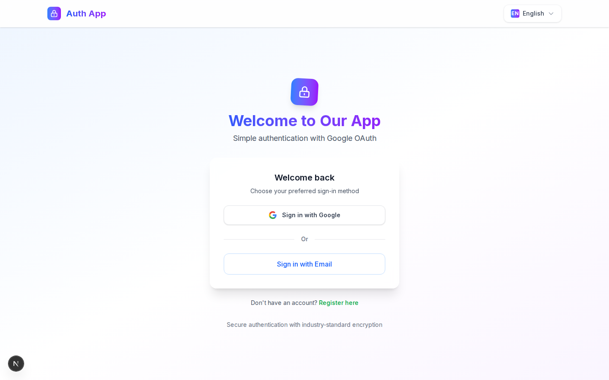
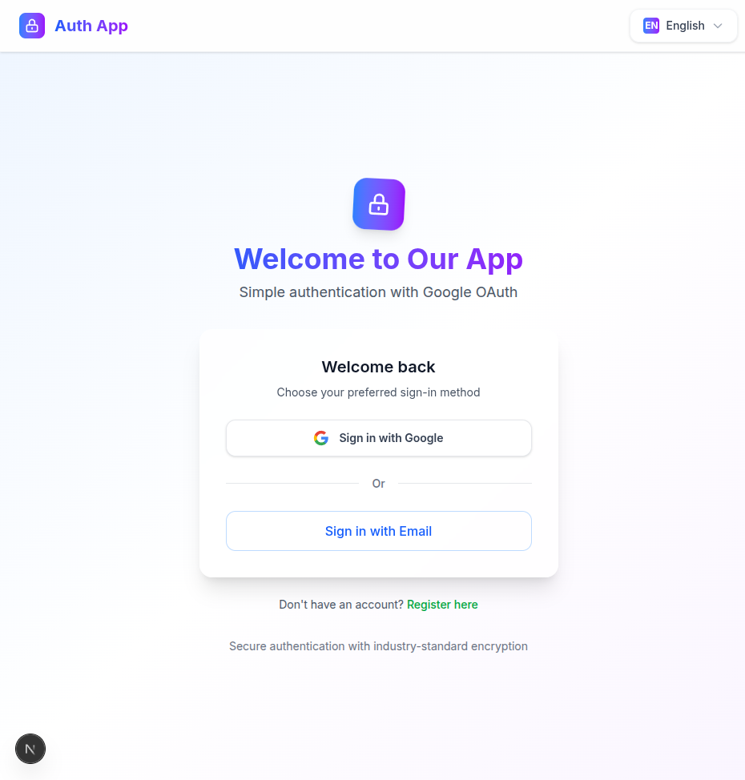
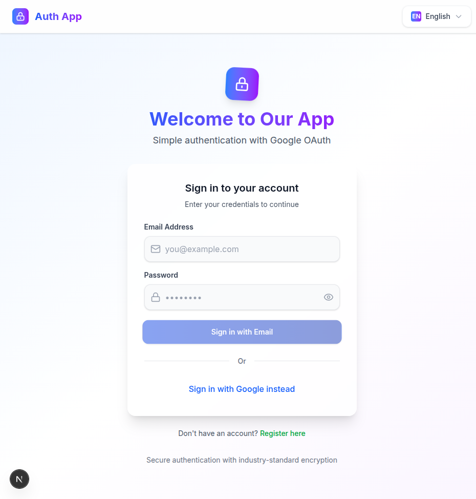
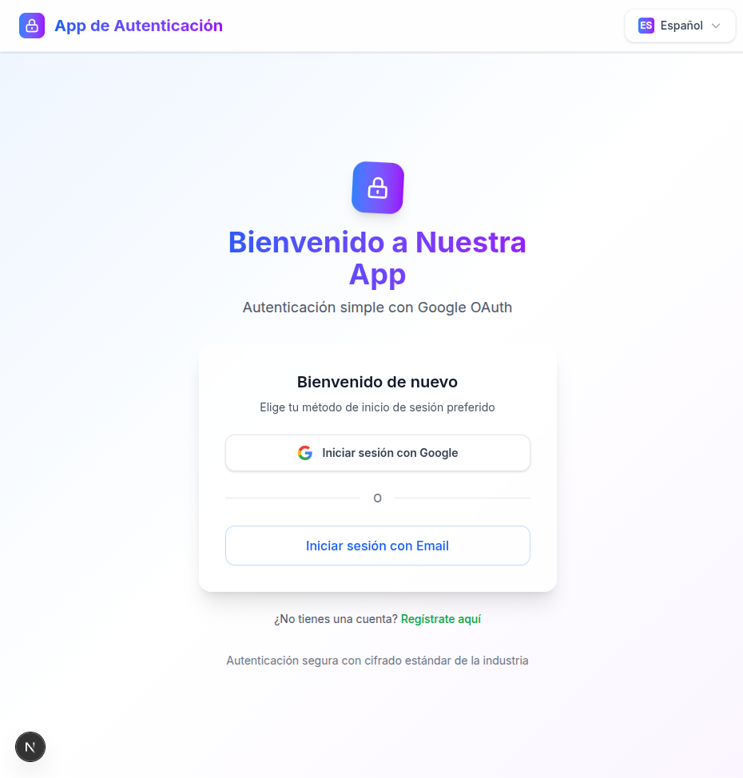
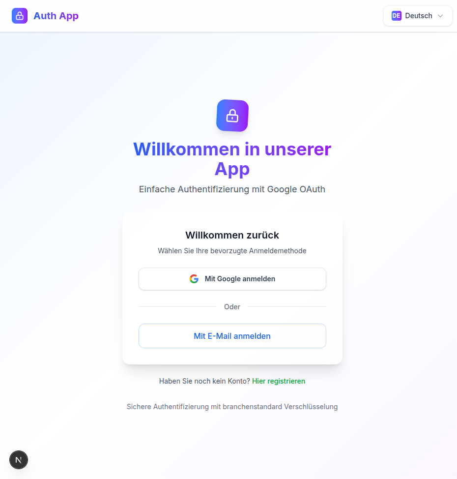
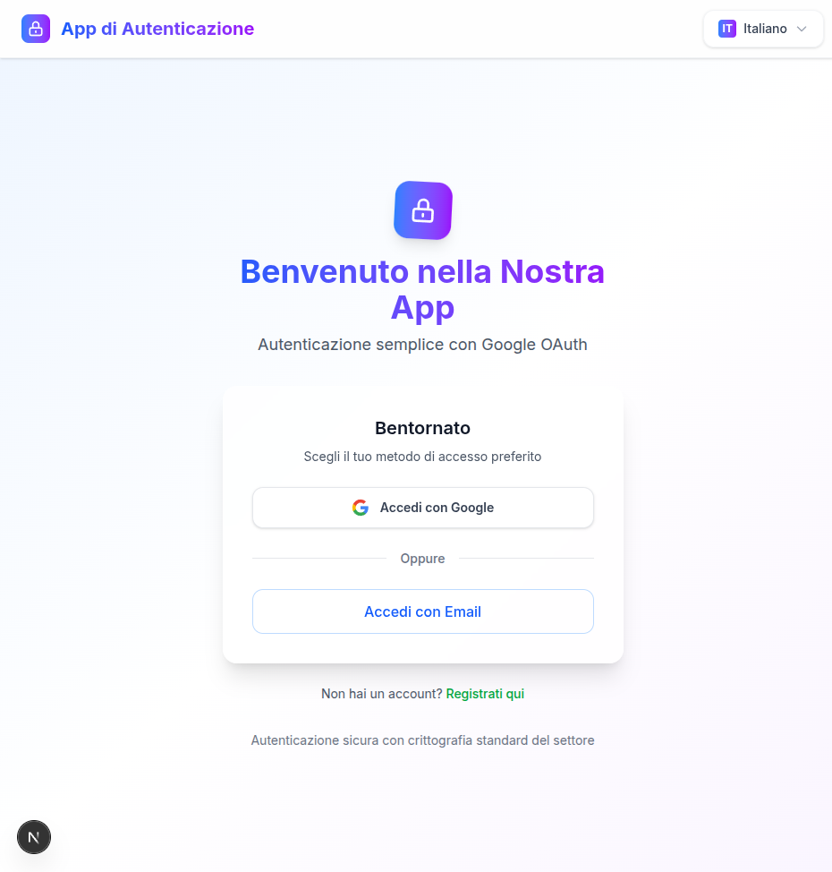

# 📸 Screenshot Regeneration Project Status

## 🎯 **PROJECT OBJECTIVE**

Regenerate deterministic, high-quality screenshots for README documentation using stable capture methods to replace current loading/animation artifacts.

---

## ✅ **COMPLETED PHASES**

### **Phase I: Infrastructure Setup** ✅ COMPLETE

- ✅ **Playwright Config Enhanced**: Added `chromium-docs` project with optimized settings
- ✅ **Production WebServer**: Configured stable production build for screenshots
- ✅ **Viewport Optimization**: 1440x900 for GitHub README display
- ✅ **Animation Disabling**: Reduced motion, stable selectors configuration
- ✅ **Pre-commit Hooks**: Added Prettier formatting checks to prevent future CI failures
- ✅ **Package Scripts**: Added `docs:shots` and `docs:shots:headless` commands

### **Phase II: Test Infrastructure** ✅ COMPLETE

- ✅ **Screenshot Spec**: Created `e2e/docs/documentation-screenshots.spec.ts`
- ✅ **Stable Selectors**: Wait for networkidle + visible elements
- ✅ **Mock Session API**: Created `/api/dev/mock-session` for protected routes
- ✅ **Directory Structure**: `e2e/docs/` and `docs/screenshots/` ready

### **Phase III: CI/CD Pipeline Fixes** ✅ COMPLETE

- ✅ **Prettier Issues**: Fixed formatting violations causing pipeline failures
- ✅ **Main Branch**: Restored to stable, deployable state
- ✅ **Pre-commit Protection**: Automatic formatting checks prevent future issues
- ✅ **Production Deployment**: All pipelines passing (Deploy SUCCESS, CI/CD running)

---

## 🔄 **CURRENT STATUS**

### **Environment Ready** ✅

- ✅ **Dev Server**: `pnpm dev` running on localhost:3000
- ✅ **Database**: PostgreSQL container running
- ✅ **Dependencies**: All packages installed and working
- ✅ **Git Status**: Clean main branch, no uncommitted changes

### **MCP Playwright Investigation** ❌ BLOCKED

- ❌ **Package Not Found**: `@modelcontextprotocol/server-playwright` doesn't exist
- ✅ **Alternative Found**: `@playwright/mcp@latest` or `@executeautomation/playwright-mcp-server`
- ⏳ **Installation Pending**: Need to configure MCP server properly

---

## 🚀 **IMMEDIATE NEXT STEPS**

### **OPTION A: MCP Playwright (Preferred)**

```bash
# Try these installation commands:
npx @playwright/mcp@latest --help
# OR
npx @executeautomation/playwright-mcp-server

# Configure in Claude Code settings
# Then use MCP tools for screenshot capture
```

### **OPTION B: Direct Playwright Execution (Fallback)**

```bash
# Since dev server is running, execute screenshot generation:
DOCS_SCREENSHOTS=true pnpm docs:shots

# Or use existing playwright installation directly:
pnpm exec playwright test e2e/docs/documentation-screenshots.spec.ts --project=chromium-docs --headed
```

---

## 📸 **REQUIRED SCREENSHOTS**

### **Target Files** (to be created in `docs/screenshots/`):

1. **`hero.png`** - Home page (clean, no loading states)
2. **`signin.png`** - Authentication page with Google OAuth visible
3. **`protected.png`** - Dashboard/protected area (or signin if not authenticated)
4. **`admin.png`** - Admin interface (with mocked ADMIN session)
5. **`locale-en.png`** - English home page
6. **`locale-es.png`** - Spanish home page
7. **`locale-fr.png`** - French home page
8. **`locale-de.png`** - German home page
9. **`locale-it.png`** - Italian home page
10. **`dark-hero.png`** - Dark mode home page (optional)

### **Screenshot Specifications**:

- **Viewport**: 1440x900 (GitHub README optimized)
- **Format**: PNG (crisp rendering)
- **Theme**: Light mode (consistent)
- **Quality**: High resolution, no compression
- **Stability**: Wait for complete load, no skeletons/spinners

---

## 📝 **README UPDATE PLAN**

### **Image Reference Updates**:

```markdown
# Current (broken):



# New (deterministic):





# Multi-language gallery:






```

---

## 🛠️ **TECHNICAL DETAILS**

### **Current File Structure**:

```
├── playwright.config.ts (✅ Enhanced with chromium-docs project)
├── e2e/docs/documentation-screenshots.spec.ts (✅ Complete spec)
├── src/app/api/dev/mock-session/route.ts (✅ Session mocking)
├── docs/screenshots/ (📁 Directory ready)
├── package.json (✅ Added docs:shots scripts)
└── .husky/pre-commit (✅ Prettier protection)
```

### **Key Configurations**:

- **Playwright Projects**: `chromium-docs` with stable settings
- **WebServer**: Production build when `DOCS_SCREENSHOTS=true`
- **Mock Sessions**: `/api/dev/mock-session?role=USER|PRO_USER|ADMIN`
- **Animation Disable**: CSS injection in test spec

---

## ⚠️ **POTENTIAL ISSUES & SOLUTIONS**

### **Issue 1: MCP Installation**

- **Problem**: Package name confusion, installation failures
- **Solution**: Try alternative packages or fallback to direct Playwright

### **Issue 2: Authentication Screenshots**

- **Problem**: Protected routes redirect to signin
- **Solution**: Mock session API endpoint already created

### **Issue 3: Loading States**

- **Problem**: Capturing before hydration complete
- **Solution**: Multiple wait strategies in spec (networkidle + visible selectors + timeout)

### **Issue 4: Animation Artifacts**

- **Problem**: Transitions blur UI
- **Solution**: CSS injection disables all animations

---

## 🎯 **SUCCESS CRITERIA**

### **Before Commit**:

1. ✅ All 10 screenshots generated successfully
2. ✅ Files exist in `docs/screenshots/` with reasonable file sizes
3. ✅ No loading spinners or skeleton states visible
4. ✅ Consistent styling and viewport across all images
5. ✅ README updated with new image references
6. ✅ All paths verified and images display correctly on GitHub

### **Post-Commit Validation**:

1. ✅ GitHub README displays all images correctly
2. ✅ Screenshots are crisp and professional
3. ✅ Multi-language gallery shows proper localization
4. ✅ Authentication flows clearly visible
5. ✅ No broken image links

---

## 📦 **FILES TO COMMIT**

```
docs/screenshots/*.png (10 new screenshot files)
README.md (updated image references)
playwright.config.ts (enhanced configuration)
e2e/docs/documentation-screenshots.spec.ts (new test spec)
src/app/api/dev/mock-session/route.ts (mock session endpoint)
package.json (new scripts)
.husky/pre-commit (prettier protection)
```

---

## 🚨 **CRITICAL NEXT ACTION**

**IMMEDIATE**: Choose screenshot capture method:

- **Option A**: Install MCP Playwright (`npx @playwright/mcp@latest`)
- **Option B**: Execute direct Playwright (`pnpm docs:shots`)

**DEV SERVER STATUS**: ✅ Running on localhost:3000 - Ready for capture!

**CONTEXT**: Compaction imminent - need to capture screenshots NOW or document for next session.
