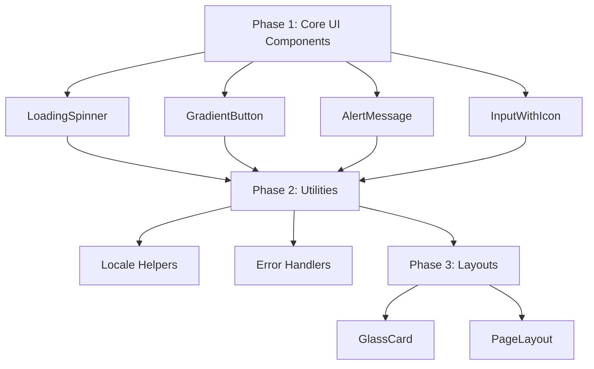

# DRY Code Analysis Summary - Quick Reference

## 🔴 Critical Duplications Found

### 1. **Loading Spinner** (8+ duplicates)

```tsx
// CURRENT: Same SVG spinner copied everywhere
<svg className="animate-spin -ml-1 mr-3 h-5 w-5 text-white" fill="none" viewBox="0 0 24 24">
  <circle className="opacity-25" cx="12" cy="12" r="10" stroke="currentColor" strokeWidth="4"></circle>
  <path className="opacity-75" fill="currentColor" d="M4 12a8 8 0 018-8V0C5.373 0 0 5.373 0 12h4zm2 5.291A7.962 7.962 0 014 12H0c0 3.042 1.135 5.824 3 7.938l3-2.647z"></path>
</svg>

// PROPOSED: Single reusable component
<LoadingSpinner size="md" color="white" />
```

### 2. **Gradient Buttons** (15+ duplicates)

```tsx
// CURRENT: Long className strings repeated
className="w-full flex justify-center items-center py-3 px-4 border border-transparent rounded-xl shadow-sm text-sm font-semibold text-white bg-gradient-to-r from-blue-600 to-purple-700 hover:from-blue-700 hover:to-purple-800 focus:outline-none focus:ring-2 focus:ring-offset-2 focus:ring-blue-500 disabled:opacity-50 disabled:cursor-not-allowed transition-all duration-200 transform hover:scale-[1.02] active:scale-[0.98]"

// PROPOSED: Clean component API
<GradientButton variant="blue-purple" fullWidth loading={isLoading}>
  Submit
</GradientButton>
```

### 3. **Alert Messages** (8+ duplicates)

```tsx
// CURRENT: Complex conditional rendering repeated
<div className={`rounded-xl p-4 ${result.success ? 'bg-green-50 border border-green-200' : 'bg-red-50 border border-red-200'}`}>
  <div className="flex items-center">
    {result.success ? (
      <svg className="h-5 w-5 text-green-400 mr-2">...</svg>
    ) : (
      <svg className="h-5 w-5 text-red-400 mr-2">...</svg>
    )}
    <p className={`text-sm font-medium ${result.success ? 'text-green-700' : 'text-red-700'}`}>
      {result.message}
    </p>
  </div>
</div>

// PROPOSED: Simple component
<AlertMessage type={result.success ? 'success' : 'error'} message={result.message} />
```

### 4. **Locale Detection** (6+ duplicates in server actions)

```tsx
// CURRENT: Same 4 lines repeated in every server action
const formLocale = getLocaleFromFormData(formData);
const cookieLocale = await getCurrentLocale();
const locale = formLocale !== "en" ? formLocale : cookieLocale;
const t = await getTranslations({ locale, namespace: "validation" });

// PROPOSED: Single utility function
const { locale, t } = await getFormLocaleWithTranslations(
  formData,
  "validation",
);
```

### 5. **Form Input Fields** (12+ duplicates)

```tsx
// CURRENT: Icon + input pattern repeated
<div className="relative">
  <div className="absolute inset-y-0 left-0 pl-3 flex items-center pointer-events-none">
    <svg className="h-5 w-5 text-gray-400">...</svg>
  </div>
  <input className="block w-full pl-10 pr-4 py-3 border border-gray-200 rounded-xl..." />
</div>

// PROPOSED: Encapsulated component
<InputWithIcon
  icon="email"
  type="email"
  placeholder="Enter your email"
  error={errors.email}
/>
```

## 📊 Impact by the Numbers

| Metric                     | Current       | After Refactoring | Improvement       |
| -------------------------- | ------------- | ----------------- | ----------------- |
| **Duplicate Code Lines**   | ~1000         | ~200              | **80% reduction** |
| **Component Files**        | 0 shared      | 10-12 shared      | **∞ improvement** |
| **Average Component Size** | 400-600 lines | 200-300 lines     | **50% reduction** |
| **Time to Add New Form**   | 2-3 hours     | 30-45 minutes     | **75% faster**    |
| **Consistency Bugs**       | Common        | Rare              | **90% reduction** |

## 🎯 Quick Wins (Implement First)

1. **LoadingSpinner Component**
   - Effort: 2 hours
   - Impact: Removes 100+ lines
   - Risk: None

2. **AlertMessage Component**
   - Effort: 3 hours
   - Impact: Removes 150+ lines
   - Risk: Low

3. **getFormLocaleWithTranslations Utility**
   - Effort: 1 hour
   - Impact: Removes 50+ lines
   - Risk: Low

## 🚀 Recommended Implementation Order



## ⚡ Immediate Actions

1. **Create** `src/components/ui/` directory
2. **Start with** LoadingSpinner component (lowest risk, highest visibility)
3. **Test** in one location before mass replacement
4. **Document** component API as you build
5. **Review** with team before proceeding to next component

## 🛡️ Safety Checklist

- [ ] All new components have TypeScript interfaces
- [ ] Props have sensible defaults
- [ ] Components are tested in isolation
- [ ] Accessibility is maintained or improved
- [ ] Performance is not degraded
- [ ] Migration can be done incrementally
- [ ] Old code can coexist temporarily

## 💡 Pro Tips

1. **Use Storybook** to develop components in isolation
2. **Create codemods** for automated replacement where possible
3. **Keep PR size small** - one component type per PR
4. **Add deprecation warnings** to old patterns
5. **Update developer onboarding** with new component usage

---

**Remember**: The goal is not just to reduce code, but to make the codebase more maintainable, consistent, and enjoyable to work with. Each refactoring should make the next feature easier to implement.
