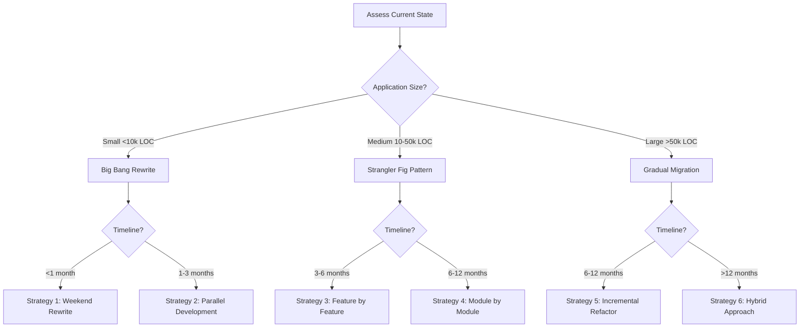
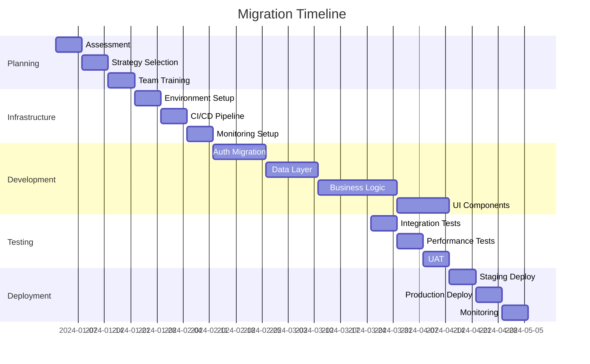

# 🚀 Migration Strategies Guide

## 📊 Migration Assessment Framework

### Step 1: Current State Analysis

#### Application Audit Checklist

```yaml
Current Stack Assessment:
  Framework:
    - [ ] Next.js version: _______
    - [ ] React version: _______
    - [ ] Node.js version: _______

  Authentication:
    - [ ] Current auth solution: _______
    - [ ] Number of users: _______
    - [ ] Auth providers used: _______

  Database:
    - [ ] Current database: _______
    - [ ] ORM/Query builder: _______
    - [ ] Data volume: _______

  Features:
    - [ ] Internationalization: Yes/No
    - [ ] Real-time features: Yes/No
    - [ ] File uploads: Yes/No
    - [ ] Payment processing: Yes/No

  Testing:
    - [ ] Test coverage: _____%
    - [ ] Test framework: _______
    - [ ] E2E tests: Yes/No

  Team:
    - [ ] Team size: _______
    - [ ] TypeScript experience: _______
    - [ ] Migration timeline: _______
```

### Step 2: Migration Path Decision



---

## 🎯 Migration Strategies

### Strategy 1: Weekend Rewrite (Small Apps)

#### When to Use

- Application < 10,000 lines of code
- Simple business logic
- < 20 database tables
- Team of 1-3 developers
- Can afford 2-3 days downtime

#### Implementation Plan

##### Friday Evening

```bash
# 1. Create new project from template
git clone template new-app
cd new-app

# 2. Copy custom business logic
cp -r ../old-app/src/custom-logic ./src/lib/

# 3. Update environment variables
cp ../old-app/.env.local .env.local
```

##### Saturday

```typescript
// 4. Migrate database schema
// Old schema
model User {
  id       Int    @id
  email    String
  name     String?
}

// New schema with enhancements
model User {
  id            String   @id @default(cuid())
  email         String   @unique
  name          String?
  emailVerified DateTime?
  password      String?
  role          String   @default("user")
  createdAt     DateTime @default(now())
  updatedAt     DateTime @updatedAt
}

// 5. Data migration script
async function migrateUsers() {
  const oldUsers = await oldDb.user.findMany()

  for (const user of oldUsers) {
    await newDb.user.create({
      data: {
        email: user.email,
        name: user.name,
        emailVerified: new Date(),
        role: 'user'
      }
    })
  }
}
```

##### Sunday

```bash
# 6. Test everything
pnpm test
pnpm test:e2e

# 7. Deploy
pnpm build
pnpm deploy

# 8. DNS switch
# Update DNS to point to new app
```

#### Rollback Plan

```bash
# Keep old app running on subdomain
old.yourdomain.com -> old app
yourdomain.com -> new app

# If issues, switch DNS back
```

---

### Strategy 2: Parallel Development (Small-Medium Apps)

#### When to Use

- Application 10,000-30,000 lines of code
- Active development ongoing
- Cannot afford downtime
- Team of 3-5 developers

#### Implementation Plan

##### Phase 1: Setup (Week 1)

```typescript
// 1. Create new app alongside old
project/
├── old-app/          # Current production
└── new-app/          # New architecture

// 2. Share database (read-only from new app initially)
// new-app/lib/database.ts
export const db = new PrismaClient({
  datasources: {
    db: {
      url: process.env.OLD_DATABASE_URL
    }
  }
})

// 3. Implement feature flags
export const features = {
  useNewAuth: process.env.USE_NEW_AUTH === 'true',
  useNewUI: process.env.USE_NEW_UI === 'true'
}
```

##### Phase 2: Feature Parity (Weeks 2-4)

```typescript
// Implement core features in new app
// Track progress with feature matrix

const featureMatrix = {
  authentication: {
    oldApp: "✅ Complete",
    newApp: "🚧 In Progress",
    tested: "⏳ Pending",
  },
  userDashboard: {
    oldApp: "✅ Complete",
    newApp: "⏳ Pending",
    tested: "⏳ Pending",
  },
  // ... more features
};
```

##### Phase 3: Gradual Cutover (Weeks 5-6)

```nginx
# Nginx configuration for gradual migration
location /auth {
    proxy_pass http://new-app:3000;
}

location /api/v2 {
    proxy_pass http://new-app:3000;
}

location / {
    proxy_pass http://old-app:3000;
}
```

---

### Strategy 3: Strangler Fig Pattern (Medium Apps)

#### When to Use

- Application 30,000-50,000 lines of code
- Complex business logic
- High traffic application
- Team of 5-10 developers

#### Implementation Plan

##### Step 1: Identify Boundaries

```typescript
// Map existing application boundaries
const appBoundaries = {
  authentication: {
    routes: ["/login", "/register", "/reset-password"],
    apis: ["/api/auth/*"],
    components: ["LoginForm", "RegisterForm"],
    priority: "HIGH",
  },

  billing: {
    routes: ["/billing", "/subscriptions"],
    apis: ["/api/billing/*", "/api/subscriptions/*"],
    components: ["BillingDashboard", "PlanSelector"],
    priority: "MEDIUM",
  },

  reporting: {
    routes: ["/reports", "/analytics"],
    apis: ["/api/reports/*"],
    components: ["ReportViewer", "ChartBuilder"],
    priority: "LOW",
  },
};
```

##### Step 2: Create Proxy Layer

```typescript
// middleware.ts - Route traffic between old and new
import { NextResponse } from "next/server";

const NEW_APP_ROUTES = [
  "/auth/*",
  "/api/auth/*",
  "/dashboard", // Migrated routes
];

export function middleware(request: NextRequest) {
  const path = request.nextUrl.pathname;

  // Check if route is migrated
  const shouldUseNewApp = NEW_APP_ROUTES.some((route) => path.match(route));

  if (shouldUseNewApp) {
    // Proxy to new app
    const url = new URL(path, process.env.NEW_APP_URL);
    return NextResponse.rewrite(url);
  }

  // Continue with old app
  return NextResponse.next();
}
```

##### Step 3: Migrate Module by Module

```typescript
// Migration tracker
export class MigrationTracker {
  private migrations = new Map<string, MigrationStatus>();

  async migrateModule(module: string) {
    this.migrations.set(module, "IN_PROGRESS");

    try {
      // 1. Copy module code
      await this.copyModuleCode(module);

      // 2. Update to new patterns
      await this.refactorToNewPatterns(module);

      // 3. Add tests
      await this.addTests(module);

      // 4. Update routing
      await this.updateRouting(module);

      // 5. Verify
      await this.verifyMigration(module);

      this.migrations.set(module, "COMPLETE");
    } catch (error) {
      this.migrations.set(module, "FAILED");
      await this.rollback(module);
    }
  }
}
```

---

### Strategy 4: Incremental Refactor (Large Apps)

#### When to Use

- Application > 50,000 lines of code
- Mission-critical application
- Zero downtime requirement
- Team of 10+ developers

#### Implementation Plan

##### Phase 1: Infrastructure Layer (Month 1)

```typescript
// 1. Add new dependencies alongside old ones
{
  "dependencies": {
    // Old auth
    "express-session": "^1.17.0",
    "passport": "^0.6.0",

    // New auth (coexisting)
    "next-auth": "^5.0.0",
    "@auth/prisma-adapter": "^2.0.0"
  }
}

// 2. Create adapter layer
export class AuthAdapter {
  private useNewAuth = process.env.FEATURE_NEW_AUTH === 'true'

  async authenticate(credentials: Credentials) {
    if (this.useNewAuth) {
      return this.newAuth.signIn(credentials)
    }
    return this.oldAuth.authenticate(credentials)
  }

  async getSession() {
    if (this.useNewAuth) {
      return this.newAuth.getSession()
    }
    return this.oldAuth.getSession()
  }
}
```

##### Phase 2: Data Layer (Month 2)

```typescript
// Gradual Prisma adoption
// 1. Generate Prisma schema from existing DB
npx prisma db pull

// 2. Create repository interfaces
interface IUserRepository {
  findById(id: string): Promise<User>
  findByEmail(email: string): Promise<User>
}

// 3. Dual implementation
export class UserRepository implements IUserRepository {
  private usePrisma = process.env.FEATURE_PRISMA === 'true'

  async findById(id: string) {
    if (this.usePrisma) {
      return await prisma.user.findUnique({ where: { id } })
    }
    // Old implementation
    return await db.query('SELECT * FROM users WHERE id = ?', [id])
  }
}
```

##### Phase 3: Business Logic (Month 3-4)

```typescript
// Gradually introduce Command pattern
export class UserService {
  // Old method (keep working)
  async createUser(data: any) {
    // Existing logic
  }

  // New method (using Command)
  async createUserV2(data: CreateUserInput) {
    const command = new CreateUserCommand();
    return await command.execute(data);
  }
}

// In routes, gradually switch
app.post("/api/users", async (req, res) => {
  if (features.useCommandPattern) {
    const result = await userService.createUserV2(req.body);
    return res.json(result);
  }

  // Old logic continues to work
  const result = await userService.createUser(req.body);
  return res.json(result);
});
```

##### Phase 4: UI Layer (Month 5-6)

```typescript
// Gradual component migration
// Old component
export default function OldLoginPage() {
  return <OldLoginForm />
}

// New component
export default function NewLoginPage() {
  return <NewLoginForm />
}

// Router with feature flag
export default function LoginPage() {
  const useNewUI = useFeatureFlag('newLoginUI')

  if (useNewUI) {
    return <NewLoginPage />
  }

  return <OldLoginPage />
}
```

---

## 📦 Data Migration Strategies

### Strategy A: Big Bang Migration

```typescript
// migrate-all.ts
async function migrateAllData() {
  const startTime = Date.now();

  console.log("Starting migration...");

  // 1. Disable writes to old system
  await oldDb.setReadOnly(true);

  try {
    // 2. Migrate users
    await migrateUsers();

    // 3. Migrate related data
    await migrateOrders();
    await migrateProducts();

    // 4. Verify data integrity
    await verifyMigration();

    // 5. Switch to new system
    await switchToNewSystem();

    console.log(`Migration complete in ${Date.now() - startTime}ms`);
  } catch (error) {
    console.error("Migration failed:", error);
    await rollback();
  }
}
```

### Strategy B: Dual Write

```typescript
// Gradually migrate with dual writes
export class DualWriteRepository {
  async create(data: any) {
    // Write to both systems
    const [oldResult, newResult] = await Promise.all([
      this.oldDb.create(data),
      this.newDb.create(this.transform(data)),
    ]);

    // Verify consistency
    if (!this.areConsistent(oldResult, newResult)) {
      await this.logInconsistency(oldResult, newResult);
    }

    return oldResult; // Return old system result during transition
  }

  async read(id: string) {
    // Read from old system primarily
    const oldData = await this.oldDb.findById(id);

    // Async verify with new system
    this.verifyAsync(id);

    return oldData;
  }

  private async verifyAsync(id: string) {
    const newData = await this.newDb.findById(id);
    if (!newData) {
      // Lazy migrate missing data
      await this.migrateSingle(id);
    }
  }
}
```

### Strategy C: Event Sourcing Migration

```typescript
// Replay events to build new state
export class EventSourcedMigration {
  async migrate() {
    // 1. Read all events from old system
    const events = await this.extractEvents();

    // 2. Transform events to new format
    const transformedEvents = events.map((e) => this.transform(e));

    // 3. Replay events in new system
    for (const event of transformedEvents) {
      await this.replayEvent(event);
    }

    // 4. Verify final state
    await this.verifyState();
  }

  private async extractEvents() {
    // Extract events from audit logs, change logs, etc.
    const auditLogs = await oldDb.auditLogs.findAll();

    return auditLogs.map((log) => ({
      type: this.inferEventType(log),
      payload: log.data,
      timestamp: log.createdAt,
    }));
  }
}
```

---

## 🧪 Testing During Migration

### Test Strategy Matrix

| Migration Phase | Test Focus           | Coverage Target |
| --------------- | -------------------- | --------------- |
| Infrastructure  | Integration tests    | 90%             |
| Data Layer      | Data integrity tests | 100%            |
| Business Logic  | Unit tests           | 95%             |
| UI Layer        | E2E tests            | 80%             |
| Complete System | Performance tests    | Baseline + 10%  |

### Migration Test Suite

```typescript
// migration-tests.spec.ts
describe("Migration Tests", () => {
  describe("Data Integrity", () => {
    it("should migrate all users", async () => {
      const oldUsers = await oldDb.users.count();
      const newUsers = await newDb.users.count();
      expect(newUsers).toBe(oldUsers);
    });

    it("should preserve user relationships", async () => {
      const oldUser = await oldDb.users.findFirst({
        include: { posts: true },
      });

      const newUser = await newDb.users.findFirst({
        where: { email: oldUser.email },
        include: { posts: true },
      });

      expect(newUser.posts.length).toBe(oldUser.posts.length);
    });
  });

  describe("Feature Parity", () => {
    it("should authenticate users", async () => {
      const credentials = { email: "test@example.com", password: "Test123!" };

      const oldAuth = await oldApp.auth(credentials);
      const newAuth = await newApp.auth(credentials);

      expect(newAuth.success).toBe(oldAuth.success);
    });
  });

  describe("Performance", () => {
    it("should maintain response times", async () => {
      const oldTime = await measureOldApp("/api/users");
      const newTime = await measureNewApp("/api/users");

      expect(newTime).toBeLessThan(oldTime * 1.1); // Allow 10% degradation
    });
  });
});
```

---

## 🔄 Rollback Strategies

### Immediate Rollback

```typescript
// rollback-immediate.ts
export class ImmediateRollback {
  async execute() {
    console.log("🔴 Initiating immediate rollback...");

    // 1. Switch traffic back
    await this.switchTrafficToOld();

    // 2. Restore database state
    await this.restoreDatabase();

    // 3. Clear caches
    await this.clearCaches();

    // 4. Notify team
    await this.notifyTeam("Rollback completed");

    console.log("✅ Rollback complete");
  }

  private async switchTrafficToOld() {
    // Update load balancer
    await loadBalancer.setTarget("old-app");

    // Update DNS if needed
    await dns.updateRecord("A", "old-app-ip");
  }
}
```

### Gradual Rollback

```typescript
// rollback-gradual.ts
export class GradualRollback {
  async execute(percentage: number = 100) {
    console.log(`🔄 Rolling back ${percentage}% of traffic...`);

    // Gradually shift traffic
    for (let i = 0; i <= percentage; i += 10) {
      await this.shiftTraffic(i);
      await this.monitorHealth();
      await this.sleep(60000); // Wait 1 minute between shifts
    }
  }

  private async shiftTraffic(percentage: number) {
    await loadBalancer.setWeights({
      "new-app": 100 - percentage,
      "old-app": percentage,
    });
  }
}
```

---

## 📊 Migration Monitoring

### Key Metrics Dashboard

```typescript
// migration-monitor.ts
export class MigrationMonitor {
  metrics = {
    // Progress metrics
    modulesTotal: 0,
    modulesComplete: 0,
    dataRowsMigrated: 0,
    dataRowsTotal: 0,

    // Health metrics
    errorRate: 0,
    responseTime: 0,
    availability: 100,

    // Business metrics
    activeUsers: 0,
    transactionsPerMinute: 0,
    conversionRate: 0,
  };

  async generateReport() {
    return {
      progress: {
        overall: `${((this.metrics.modulesComplete / this.metrics.modulesTotal) * 100).toFixed(1)}%`,
        data: `${((this.metrics.dataRowsMigrated / this.metrics.dataRowsTotal) * 100).toFixed(1)}%`,
        timeline: this.calculateTimelineStatus(),
      },

      health: {
        status: this.getHealthStatus(),
        errors: this.metrics.errorRate,
        performance: this.metrics.responseTime,
      },

      business: {
        impact: this.calculateBusinessImpact(),
        users: this.metrics.activeUsers,
        revenue: this.calculateRevenueImpact(),
      },
    };
  }
}
```

### Monitoring Checklist

```yaml
Pre-Migration:
  - [ ] Baseline performance metrics captured
  - [ ] Error tracking configured
  - [ ] Alerting rules defined
  - [ ] Dashboards created

During Migration:
  - [ ] Real-time error monitoring
  - [ ] Performance degradation alerts
  - [ ] Data integrity checks
  - [ ] User experience monitoring

Post-Migration:
  - [ ] Performance comparison
  - [ ] Error rate analysis
  - [ ] User satisfaction metrics
  - [ ] Business KPI validation
```

---

## 🎯 Success Criteria

### Technical Success Metrics

| Metric            | Target  | Measurement      |
| ----------------- | ------- | ---------------- |
| All tests passing | 100%    | CI/CD pipeline   |
| TypeScript errors | 0       | `pnpm typecheck` |
| Page load time    | < 3s    | Lighthouse       |
| API response time | < 200ms | APM tools        |
| Error rate        | < 0.1%  | Error tracking   |
| Uptime            | > 99.9% | Monitoring       |

### Business Success Metrics

| Metric           | Target              | Measurement       |
| ---------------- | ------------------- | ----------------- |
| User retention   | > 95%               | Analytics         |
| Feature adoption | > 80%               | Feature flags     |
| Support tickets  | < 10% increase      | Help desk         |
| Revenue impact   | Neutral or positive | Financial reports |

---

## 🚨 Common Pitfalls & Solutions

### Pitfall 1: Underestimating Complexity

**Problem**: Migration takes 3x longer than estimated

**Solution**:

```typescript
// Add buffer to estimates
const estimatedTime = baseEstimate * complexityFactor * 1.5;

// Complexity factors:
// - Legacy code quality: 1.2-2.0
// - Data migration: 1.3-1.8
// - Team experience: 0.8-1.5
// - Business logic complexity: 1.2-2.5
```

### Pitfall 2: Data Loss During Migration

**Problem**: Missing or corrupted data after migration

**Solution**:

```typescript
// Always backup and verify
async function safeMigration() {
  // 1. Backup
  const backup = await createBackup();

  // 2. Migrate with verification
  const migrated = await migrate();
  const verified = await verify(migrated);

  if (!verified) {
    await restoreFromBackup(backup);
    throw new Error("Verification failed");
  }

  // 3. Keep backup for 30 days
  await scheduleBackupDeletion(backup, 30);
}
```

### Pitfall 3: Feature Parity Gaps

**Problem**: New system missing features users depend on

**Solution**:

```typescript
// Feature inventory before migration
const featureInventory = {
  critical: [
    'user-login',
    'payment-processing',
    'report-generation'
  ],

  important: [
    'bulk-export',
    'advanced-search',
    'custom-dashboards'
  ],

  nice-to-have: [
    'themes',
    'keyboard-shortcuts'
  ]
}

// Validate all critical features migrated
for (const feature of featureInventory.critical) {
  if (!newSystem.hasFeature(feature)) {
    throw new Error(`Critical feature missing: ${feature}`)
  }
}
```

---

## 📅 Sample Migration Timeline

### 12-Week Migration Plan



---

## ✅ Migration Completion Checklist

### Phase 1: Planning Complete

- [ ] Current state documented
- [ ] Migration strategy selected
- [ ] Timeline established
- [ ] Team trained
- [ ] Rollback plan created

### Phase 2: Development Complete

- [ ] All features migrated
- [ ] Tests written and passing
- [ ] Documentation updated
- [ ] Code reviewed
- [ ] Performance validated

### Phase 3: Testing Complete

- [ ] Unit tests: 100% pass
- [ ] Integration tests: 100% pass
- [ ] E2E tests: 100% pass
- [ ] Performance benchmarks met
- [ ] Security audit passed

### Phase 4: Deployment Complete

- [ ] Staging deployment successful
- [ ] Production deployment successful
- [ ] Monitoring active
- [ ] Alerts configured
- [ ] Team handoff complete

### Phase 5: Post-Migration

- [ ] Old system decommissioned
- [ ] Documentation finalized
- [ ] Lessons learned documented
- [ ] Team retrospective held
- [ ] Success metrics achieved

---

**Ready to migrate with confidence!** 🚀
